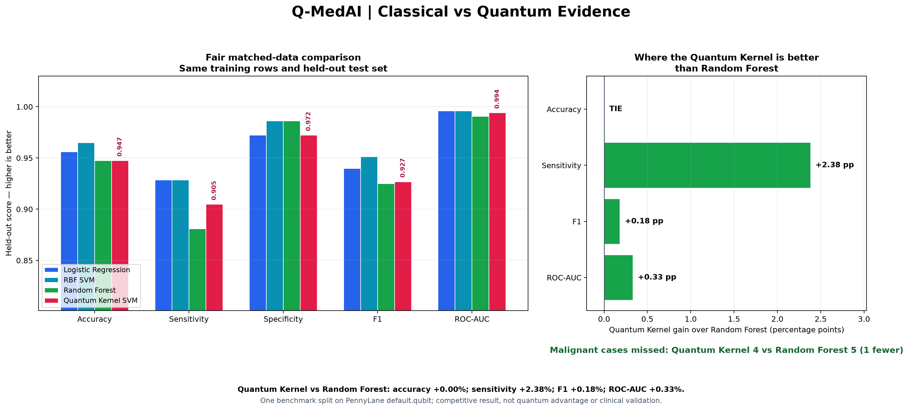

# Q-MedAI

Q-MedAI is an SIH 2026 (Problem Statement 26139) hybrid quantum-classical research platform with one combined faculty experience and two deliberately separate evidence roles:

- **Framingham is the primary prospective clinical workflow.** It accepts 15 baseline measurements and uses verified frozen artifacts to produce classical, quantum, and hybrid **uncalibrated research-model scores** for 10-year CHD research.
- **Breast Cancer is a separate quantum evidence benchmark.** It preserves the authoritative matched classical-versus-quantum diagnostic-classification experiment and all saved metrics, figures, and downloads.

The repository is self-contained for READY-mode faculty demonstration. The bundled Framingham artifact ID is `qmedai-framingham-b98c306b5b44`.

> Q-MedAI is a research prototype, not a medical diagnostic device. It has no external clinical validation. PennyLane `default.qubit` is a classical quantum-circuit simulator, not physical quantum hardware. The project makes no universal or computational quantum-advantage claim.

## Current task-specific verdicts

| Task | Evidence role | Current verdict | Required interpretation |
|---|---|---|---|
| Framingham 10-year CHD | Primary prospective workflow | `CLASSICAL-PREFERRED` | Logistic Regression is the evidence-supported primary pathway; all outputs remain uncalibrated research-model scores. |
| Breast Cancer | Separate matched benchmark | `QUANTUM-COMPETITIVE` | Quantum Kernel SVM has a selective sensitivity benefit versus Random Forest on the saved matched split; RBF SVM remains strongest overall. |

The verdicts are task-specific. They do not imply that classical or quantum ML is universally superior.

## Launch the faculty demo

Current worktree and verified parent environment:

```bash
cd /Users/mymac/Desktop/Q-MedAI/.worktrees/combined-faculty-demo
/Users/mymac/Desktop/Q-MedAI/.venv/bin/streamlit run app.py --server.port 8511 --browser.gatherUsageStats false
```

Open <http://localhost:8511> if the browser does not open automatically.

Fresh clone or extracted package:

```bash
cd /path/to/Q-MedAI
python3.12 -m venv .venv
.venv/bin/python -m pip install -r requirements.txt
.venv/bin/python -m pytest tests/test_framingham_builder.py::test_committed_real_artifacts_are_ready_and_score_distinct_patients -q
.venv/bin/streamlit run app.py --server.port 8511 --browser.gatherUsageStats false
```

The default page is **Command Center**. For the complete timed presentation, follow [FACULTY_DEMO_GUIDE.md](FACULTY_DEMO_GUIDE.md).

## Faculty navigation

1. **Command Center** — two-task story, artifact readiness, and current utility verdicts.
2. **Patient Risk** — READY-mode Framingham form and verified classical/quantum/hybrid research scores.
3. **Quantum Lab** — the same session’s patient-specific four-qubit encoding, circuit, and fidelity-kernel trace.
4. **Model Arena** — complete Framingham evidence and unmatched-resource warning.
5. **Breast Cancer Evidence** — matched benchmark, all authoritative plots, and evidence downloads.
6. **Quantum Utility** — deterministic task-specific verdicts without a forced quantum winner.
7. **Provenance & Safety** — manifest, evidence sources, limitations, and joblib trust boundary.
8. **Research Runner** — optional session-only experiments that never overwrite authoritative artifacts.

Patient inputs are held only in the current Streamlit session. They are not written to disk or analytics. Run Patient Risk first, then open Quantum Lab in the same browser session to inspect that exact patient’s quantum trace.

## Bundled Framingham READY mode

The five canonical artifacts are committed under [`artifacts/framingham/`](artifacts/framingham/):

- `model_manifest.json`
- `classical_pipeline.joblib`
- `quantum_bundle.joblib`
- `hybrid_bundle.joblib`
- `frozen_notebook_metrics.json`

Before deserializing joblib, Q-MedAI verifies canonical names, SHA-256 hashes, manifest structure, model identity, and runtime compatibility. Arbitrary user-uploaded or downloaded pickle/joblib files are unsupported; the app has no artifact uploader.

The frozen quantum branch uses four selected features—`age`, `sysBP`, `prevalentHyp`, and `diaBP`—with the exact sequence `H → RY(x) → RZ(0.5x) → ring-CZ → RY(x²/π)` and a fidelity kernel on PennyLane `default.qubit`.

If the artifact set becomes incomplete or fails validation, the app enters safe evidence mode: the full form and evidence remain visible, inference is disabled, and Q-MedAI produces **no patient score**. See [`artifacts/framingham/README.md`](artifacts/framingham/README.md) for verification and deterministic rebuild instructions.

## Framingham evidence boundary

The supplied executed evidence gives ROC-AUC 0.7345 for Logistic Regression, 0.7062 for Hybrid CML + QML, and 0.6581 for Quantum Kernel SVM. This supports `CLASSICAL-PREFERRED` for the primary Framingham workflow.

The comparison is not resource-matched: quantum and hybrid models use 500 training rows and four features, while full-data classical models use 3,306 rows and 15 features. Mutual-information feature selection was learned before the stacking folds. The public preprocessed cohort provenance was not independently verified beyond the recorded source/hash. There is no external clinical validation or demonstrated calibration.

## Breast Cancer final experiment

The authoritative executed Breast Cancer artifacts remain in [`results/`](results/): [JSON](results/final_results.json), [CSV](results/final_results.csv), [exact configuration](results/final_config.json), and presentation plots. [FINAL_EXPERIMENT_REPORT.md](FINAL_EXPERIMENT_REPORT.md) and [SIH_FINAL_SUMMARY.md](SIH_FINAL_SUMMARY.md) are derived from the saved final artifact.

The final methodology uses:

- supplied `data/breast_cancer.csv`; its external source provenance was not independently verified from the supplied project files;
- B = 0 (benign / negative) and M = 1 (malignant / positive);
- stratified 80/20 train/test split, `random_state=42`;
- train-only median imputation, scaling, and `SelectKBest(f_classif)` with four features;
- full-data Logistic Regression, RBF SVM, Random Forest, and a 4-qubit VQC (3 layers, 100 iterations);
- 150-row stratified fidelity quantum-kernel SVM; and
- a separate matched-data comparison where all four compared models use the exact same 150 raw training rows and separately fitted subset-only preprocessing.

### Visual evidence

The clearest judge-facing figure is the fair matched-data comparison below. All four displayed models use the same 150 training observations and the same 114 held-out test observations.



In the saved matched experiment, the Quantum Kernel tied Random Forest on accuracy and improved sensitivity by 2.38 percentage points, F1 by 0.18 percentage points, and ROC-AUC by 0.33 percentage points. RBF SVM remained the strongest overall model. This is a competitive and selectively stronger quantum result—not universal quantum advantage.

Additional evidence:

- [Matched-data ROC curves](results/plots/matched_data_roc_curves.png)
- [Matched-data confusion matrices](results/plots/matched_data_confusion_matrices.png)
- [Full-data ROC curves](results/plots/full_data_roc_curves.png)
- [Full-data confusion matrices](results/plots/full_data_confusion_matrices.png)
- [Accuracy comparison](results/plots/accuracy_comparison.png)
- [F1 comparison](results/plots/f1_comparison.png)
- [ROC-AUC comparison](results/plots/roc_auc_comparison.png)

### Most important remaining Breast Cancer evidence gap

The main missing evidence is statistical robustness, not graphical polish. The saved experiment uses one dataset and one train/test split, without repeated-seed confidence intervals or external clinical validation. The dataset is cross-sectional, so the project evaluates malignant-class detection; it does not prove earlier-in-time diagnosis. A stronger next experiment would use repeated stratified splits or nested cross-validation, paired uncertainty estimates, and an external biomedical dataset.

Quantum circuits use PennyLane `default.qubit`, a classical simulator—not a physical quantum computer. The final VQC has a cooperative 600-second limit; statuses and missing metrics are preserved exactly in the artifacts.

#### Historical local baseline

The earlier verified local baseline (2-layer/35-iteration VQC and 50-row quantum kernel) is preserved as historical context only. It was not rerun and is not the final experiment. Its 50-row kernel result had a training-size mismatch with full-data classical models, which the final matched-data study explicitly addresses.

## Architecture

```text
Framingham baseline values
    → verified frozen preprocessing
    → classical / quantum-kernel / hybrid research scores
    → task-specific Utility Engine verdict
    → same-session Quantum Lab trace

Breast Cancer CSV
    → validation and B/M encoding → stratified split
    → train-only preprocessing → classical / VQC / quantum-kernel models
    → held-out metrics, saved plots, and matched evidence benchmark
```

`app.py` is the thin Streamlit entry point. `src/demo/` owns evidence loading, trusted artifact checks, Framingham inference, utility verdicts, quantum visualization, and page composition. The generic exploratory runner remains session-only and runs only when the user selects **Research Runner**.

## Installation and verification

Tested artifact runtime: Python **3.12.12** with `numpy==2.5.2`, `pandas==3.0.5`, `scikit-learn==1.9.0`, and `pennylane==0.45.1`. The current application also uses `streamlit==1.62.0`.

```bash
python3.12 -m venv .venv
.venv/bin/python -m pip install -r requirements.txt
.venv/bin/python -m pytest -q
.venv/bin/python -m compileall -q app.py src kaggle scripts tests
```

## Kaggle instructions

### Breast Cancer experiment

1. Open Kaggle and create or open a Notebook.
2. Upload/add the complete Q-MedAI project directory and `breast_cancer.csv` as Kaggle inputs.
3. Open `kaggle/Q_MedAI_Final_Experiment.ipynb` and run the dataset-discovery cell; it prints the exact path used and fails clearly if the CSV is missing.
4. Enable an accelerator only if supported by the notebook/backend. PennyLane `default.qubit` does not automatically use a GPU.
5. Run all cells once. The notebook prints full-data and matched-data tables and saves actual results/plots under Kaggle working storage.
6. Review the final tables and plots.

### Framingham artifact rebuild

The READY artifacts are already bundled. For a controlled rebuild using the exact public `CHD_preprocessed.csv`:

```bash
.venv/bin/python -m scripts.build_framingham_artifacts \
  --data /absolute/path/to/CHD_preprocessed.csv \
  --output-dir artifacts/framingham
```

The builder reproduces the seed-42 procedure and passes fitted objects to `kaggle/framingham_artifact_export.py`. It does not create mock or handcrafted patient outputs. Review the new manifest and rerun the focused READY-state test before use.

## Limitations and future work

Both tasks are feasibility studies on supplied public/supplied data. There is no regulatory readiness, external clinical validation, repeated-split statistical confidence, physical quantum hardware, or universal quantum-advantage claim. Framingham scores are not demonstrated to be calibrated. Breast Cancer is cross-sectional and does not prove earlier-in-time diagnosis.

Future work should prioritize repeated-seed or nested cross-validation, paired confidence intervals, probability calibration, fairness assessment, external biomedical validation, prospective evaluation, privacy/security review, and carefully controlled hardware/noise studies.

## Project structure

```text
app.py                              Thin combined Streamlit entry point
FACULTY_DEMO_GUIDE.md               Six-minute READY-mode presentation guide
src/demo/                           Evidence, artifacts, inference, utility, visualization, and pages
artifacts/framingham/               Bundled verified Framingham artifact set
results/framingham/                 Executed Framingham evidence summary
results/                            Authoritative Breast Cancer JSON/CSV/config and plots
scripts/build_framingham_artifacts.py  Deterministic Framingham rebuild entry point
kaggle/                             Executed notebooks and trusted exporter
SIH_FINAL_SUMMARY.md                Faculty talking points, saved metrics, and Q&A
tests/                              Unit, integration, artifact, and AppTest coverage
```
